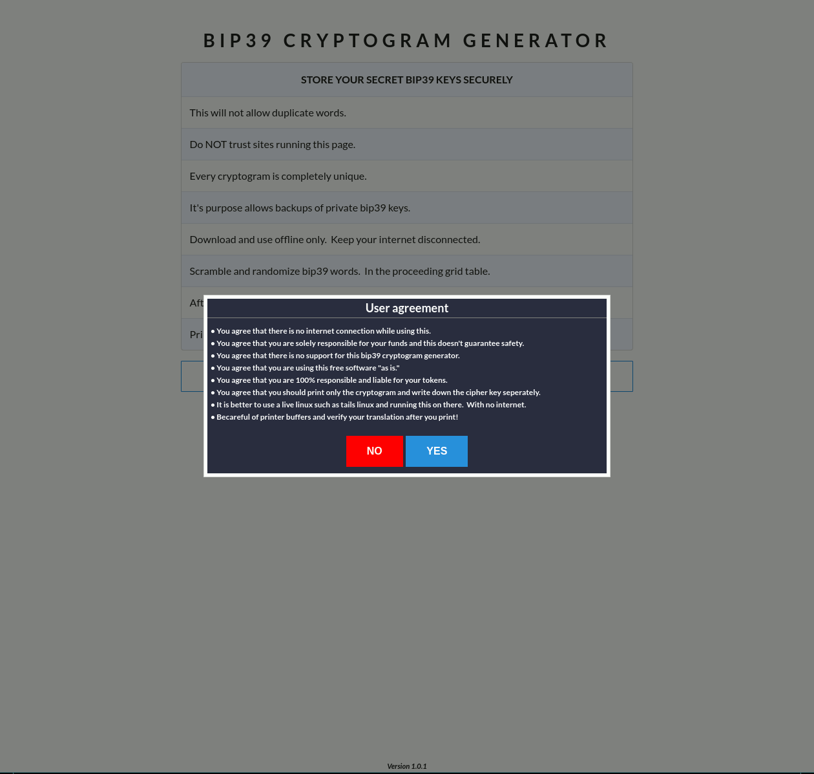

# BIP39 CRYPTOGRAM GENERATOR

## What does this do?
It scrambles and randomizes a bip39 24 word key.  
Scramble your Cardano Daedalus key.  

## How to install?
On a bootable live linux and while connected to the internet  
Install latest nodejs with npm from  https://nodejs.org  
Extract the .tar.xz file.  tar xvf node-v15.12.0-linux-x64.tar.xz
Symlink the extracted folder, example:  ln -s node-v15.12.0-linux-x64 nodejs  
Set your path:  export PATH=$HOME/nodejs/bin:$PATH  
npm install -g yarn  
git clone https://github.com/SneakyWizard/ReactCardanoHiddenBip39.git  
cd ReactCardanoHiddenBip39/hide-ada  
yarn install  

## How to run?
yarn start  

## Use at your own risk.
Follow the rules by not being online when this is ran.  
Follow all possible security measures such as running this on a live linux.  
Print only the cryptogram and writing down the cipher key.  

## If you see any web site running this.  DO NOT USE!!!!!!
You have been warned.

## Example.

